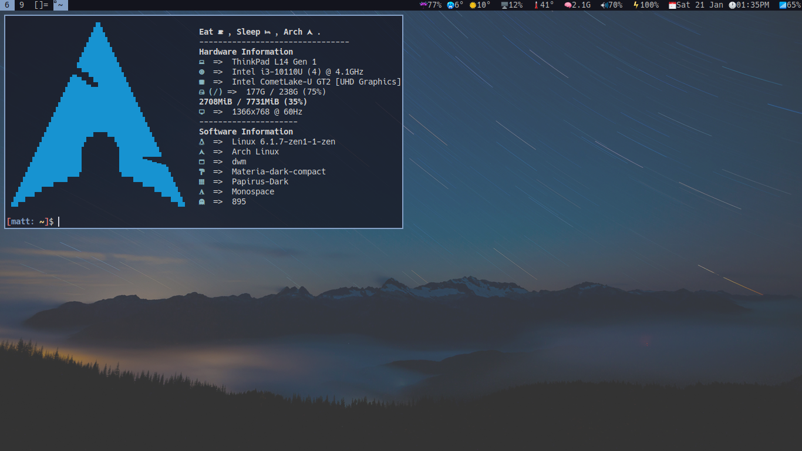

# Jims Dotfiles!
My own dotfiles and configs including all my suckless configs (dwm etc.) as well as other things like my i3 setup.

**NOTE:** These dotfiles are very outdated (except for i3, i3lock and polybar) and it's not recommended to use them!

