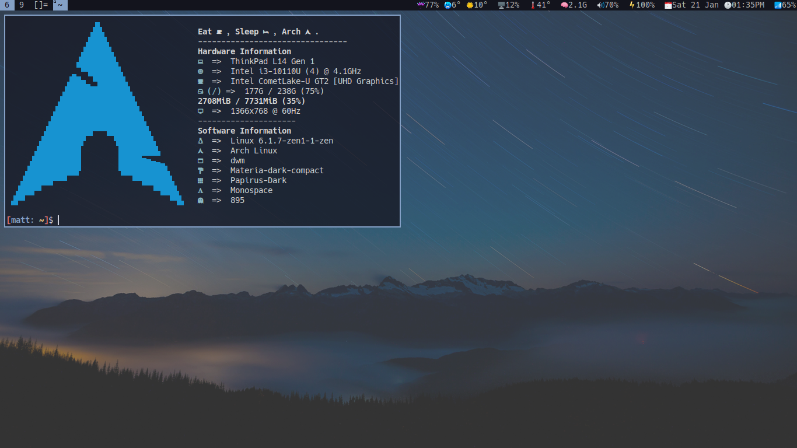

# Jim's Dotfiles!
My own dotfiles and configs including all my suckless configs (dwm etc.) as well as other things like my i3 setup and various scripts.
The bin directory contains the scripts I have and the config directory is where all my configs are. 

